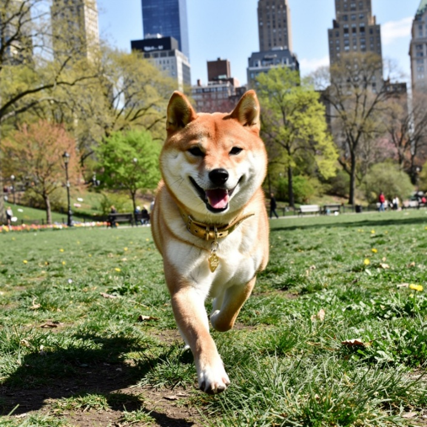
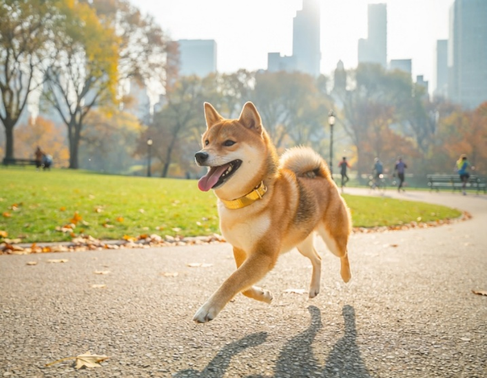
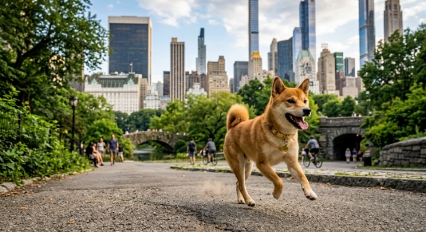
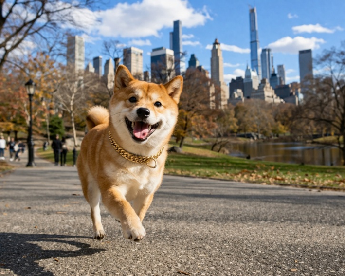
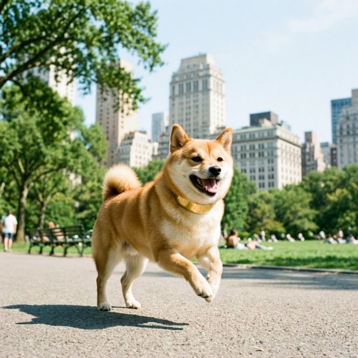
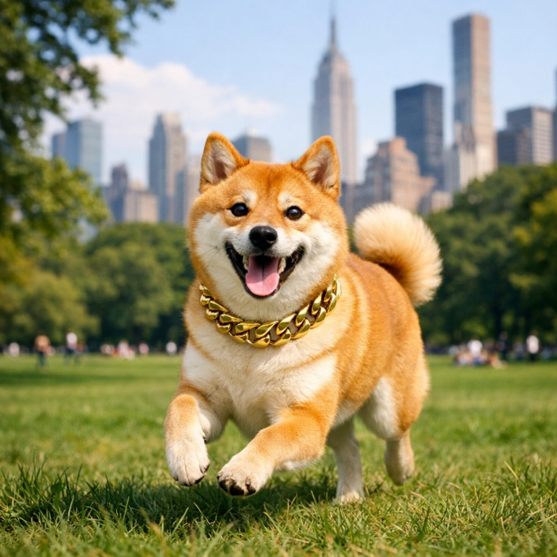
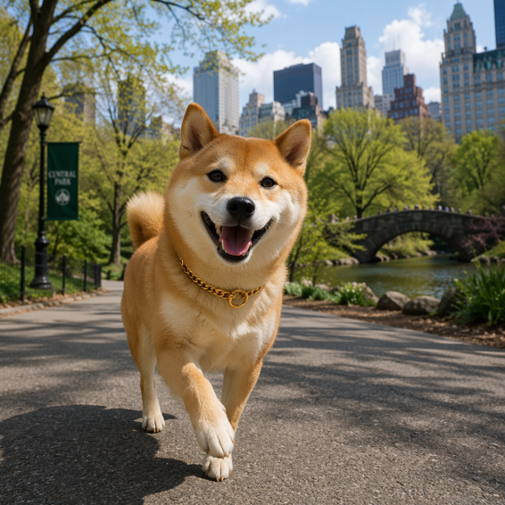
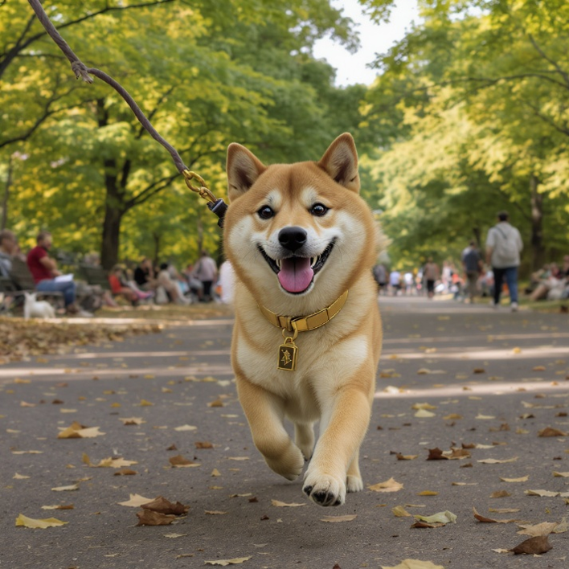

# Comparative Analysis of Image AI Models Using a Unified Prompt

*Output-Based Evaluation Versus Benchmarking*

**Linda Zhang**

Generative image models are integral to workflows in design, marketing, product prototyping, and demos. Evaluation methods often rely on benchmarks or curated examples, which don’t always reflect real-world behavior.

At Microsoft Build 2026, **MAI-Image 2.5** introduced major improvements in quality, prompt fidelity, controllable editing, and text rendering. This raises a key question:

> **How do models actually perform side by side with the exact same prompt?**

---

# Methodology

## Prompt

> **"A shiba inu dog runs in Central Park, New York City. Its color is yellow brown. She has a golden metal neck collar. She is happy."**

This prompt tests:
- Subject recognition
- Motion (running)
- Location grounding
- Physical constraints
- Emotional expression

---

## Models Tested

- Firefly Image 5  
- Gemini 3.1 (Nano Banana 2)  
- FLUX2 Pro  
- FLUX1 KontextPro  
- GPTImage 1.5  
- GPT-Image 2.0  
- MAI-Image 2.5  
- DALL·E 3  

---

# Evaluation Criteria

| Criterion | Description |
|----------|------------|
| Running | Visible motion cues |
| Central Park + NYC | Location accuracy |
| Color | Yellow-brown coat |
| Collar | Gold metallic collar |
| Happiness | Expression/posture |

---

# Model Outputs

## FLUX2 Pro
  
Strong motion realism and environmental depth.

## Firefly Image 5
  
Clean composition, strong prompt fidelity.

## Gemini 3.1
  
Cinematic lighting and contrast.

## DALL·E 3
  
Expressive and stylized.

## MAI-Image 2.5
  
Clear subject and strong emotional expression.

## GPTImage 1.5
  
Accurate and visually balanced.

## GPT-Image 2.0
  
Strong location grounding and realism.

## FLUX1 KontextPro
  
Realistic motion with subtle urban cues.

---

# Summary

| Model | Strengths | Tradeoffs |
|------|----------|----------|
| FLUX2 Pro | Motion realism | Less polished styling |
| Firefly Image 5 | Clean, brand-safe | Less dynamic motion |
| Gemini 3.1 | Cinematic visuals | Moderate motion |
| FLUX1 KontextPro | Realism + movement | Weaker location cues |
| GPTImage 1.5 | Accuracy + polish | Subtle motion |
| MAI-Image 2.5 | Expression + clarity | Less dynamic scenes |
| DALL·E 3 | Expressive | Less constraint fidelity |
| GPT-Image 2.0 | Realism + grounding | Controlled motion |

---

# Key Takeaways

- No single "best" model
- Tradeoffs vary by use case
- Output comparison > benchmarks for real decisions

> **The prompt is only half the story. The model interpretation is the other half.**

---

# Repository Structure
